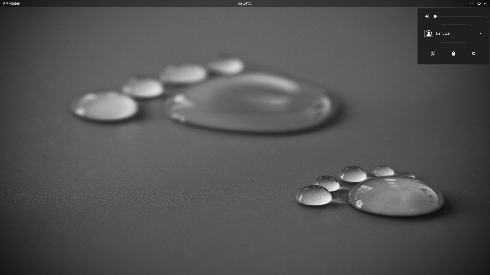
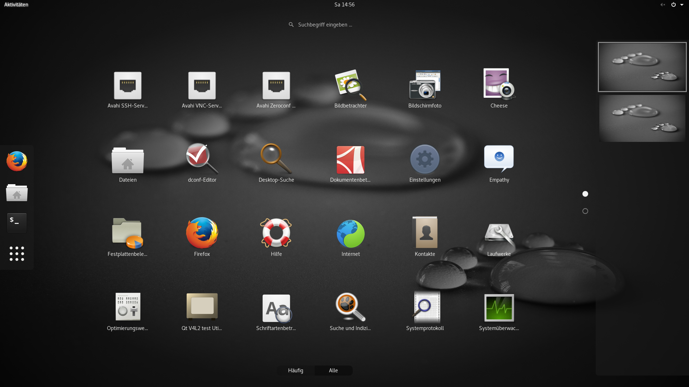
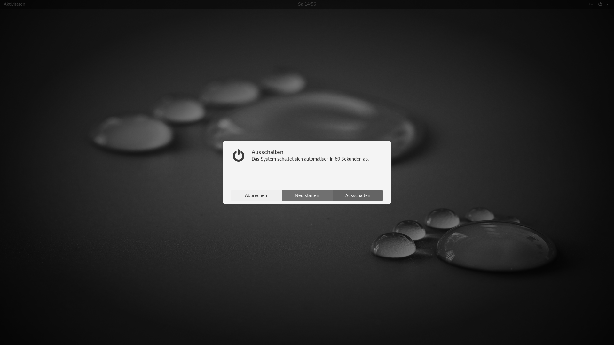

# Copernico Grayscale
Copernico Grayscale is a Gnome Shell theme with the main objective to provide a
clean and unobtrusive experience.

The theme was originally developed by the Gnome Team and incorporates
modifications by Michael Yugcha [@mgyugcha](https://www.twitter.com/mgyugcha)
and is licensed under the terms of the [GPLv3 license](LICENSE).

## References
* The project this here was forked from:
  https://github.com/mgyugcha/copernico-theme

## Screenshots

### Desktop

### Applications

### End Session

